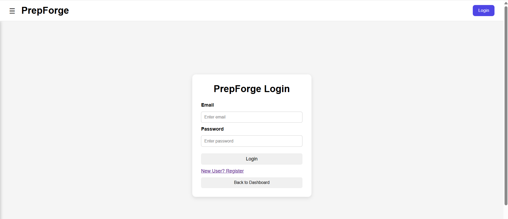
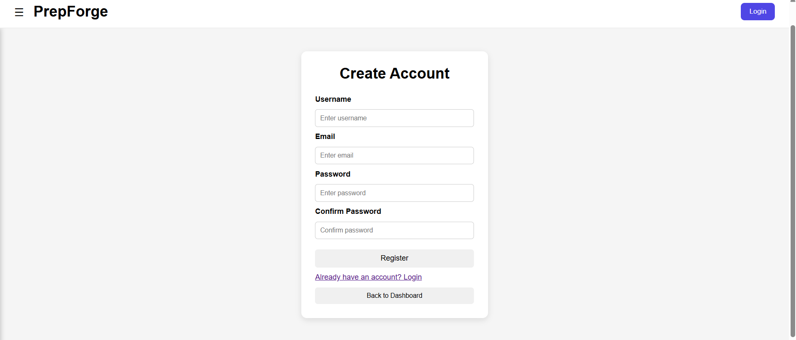
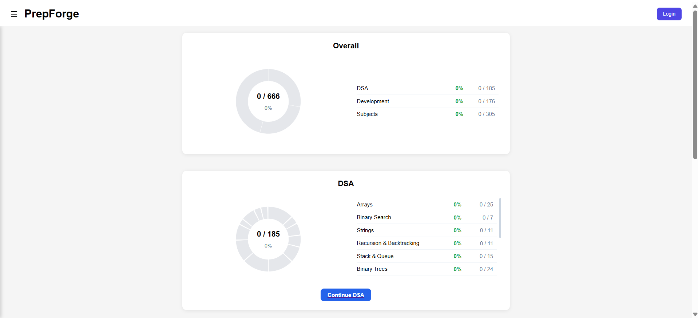
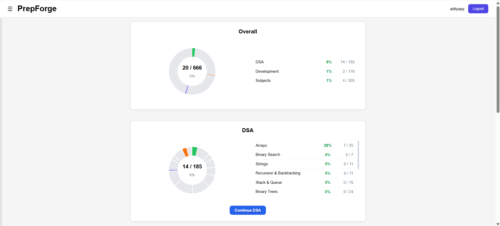
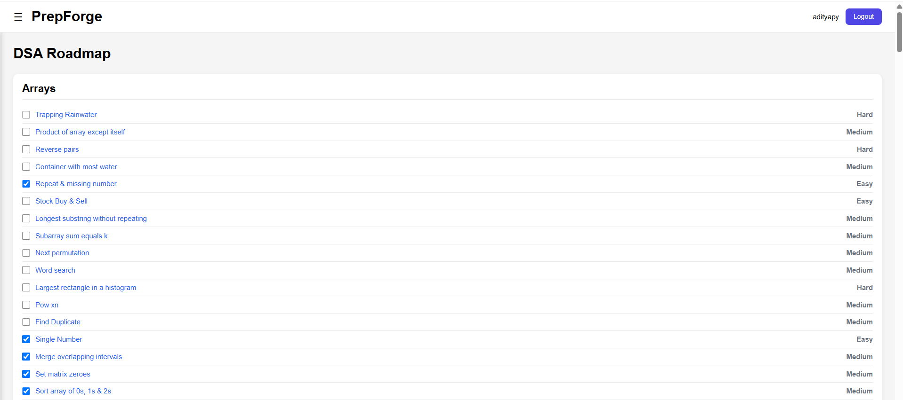
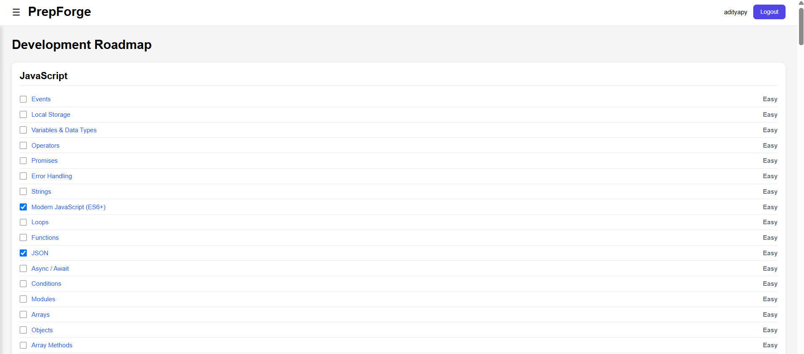
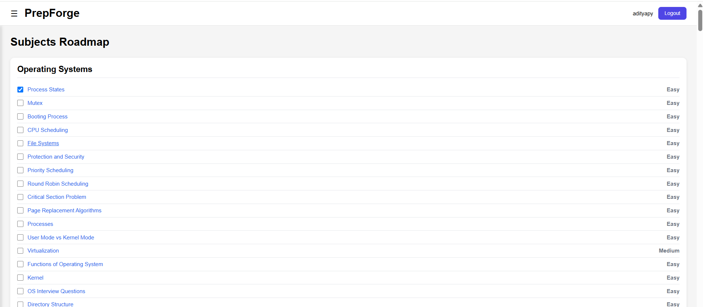

# 🚀 PrepForge


PrepForge is a full-stack interview preparation platform built to help students organize and track their progress across Data Structures & Algorithms, Development, and Core Subjects.

It provides a clean dashboard, persistent progress tracking, secure authentication, and an organized roadmap for placement preparation.

---

## 💡 Why PrepForge?

PrepForge was built to provide a single platform for interview preparation by combining DSA practice, development roadmaps, and core subject tracking. Instead of managing progress across multiple tools, users can organize and monitor everything in one place.

## 🌐 Live Demo

**Website:** https://prep-forge-gamma.vercel.app/

---

> **Note:** The backend is hosted on Render's free tier and may take up to a minute to respond on the first request after a period of inactivity.

# ✨ Features

* 🔐 JWT Authentication
* 👤 User Registration & Login
* 💾 Persistent Login (30-day JWT)
* 📊 Interactive Progress Dashboard
* ✅ DSA Problem Tracking
* 💻 Development Roadmap
* 📚 Subject-wise Progress Tracking
* ☁️ MongoDB Atlas Database
* 📱 Responsive UI
* 🔄 Progress Persists Across Sessions
* 🚀 Deployed Frontend & Backend
* 🔒 Protected REST APIs
* 🌐 Full-stack Architecture

---

# 🛠 Tech Stack

## Frontend

* React
* Vite
* React Router
* CSS
* Recharts

## Backend

* Spring Boot
* Spring Security
* JWT Authentication
* Spring Data MongoDB

## Database

* MongoDB Atlas

## Deployment

* Frontend: Vercel
* Backend: Render

---

# 🏗 Architecture

```text
                React + Vite (Vercel)
                        │
                        │ REST API
                        ▼
          Spring Boot + Spring Security
                        │
                        ▼
                  MongoDB Atlas
```

---

# 📷 Screenshots

## Login

<p align="center">
  
</p>

---

## Registration

<p align="center">
  
</p>

---

## Dashboard

<p align="center">
  
</p>

---

## Dashboard (Logged In)

<p align="center">
  
</p>

---

## DSA Module

<p align="center">
  
</p>

---

## Development Module

<p align="center">
  
</p>

---

## Subjects Module

<p align="center">
  
</p>

---

# 📂 Project Structure

```text
PrepForge/
│
├── client/                      # React Frontend
│   ├── src/
│   ├── public/
│   ├── package.json
│   └── ...
│
├── prepforge-api/               # Spring Boot Backend
│   ├── src/main/java/
│   │   ├── config/
│   │   ├── controller/
│   │   ├── dto/
│   │   ├── model/
│   │   ├── repository/
│   │   ├── security/
│   │   └── service/
│   │
│   ├── src/main/resources/
│   ├── pom.xml
│   └── ...
│
├── screenshots/
└── README.md
```

---

# ⚙️ Local Setup

## Clone Repository

```bash
git clone https://github.com/Aditya-Pandey-208/PrepForge.git
cd PrepForge
```

---

## Backend

```bash
cd prepforge-api
```

Configure your MongoDB connection in:

```properties
application.properties
```

Run:

```bash
./mvnw spring-boot:run
```

Backend runs on:

```text
http://localhost:8081
```

---

## Frontend

```bash
cd client
npm install
npm run dev
```

Frontend runs on:

```text
http://localhost:5173
```

---

# 🔐 Authentication

PrepForge uses JWT (JSON Web Tokens) for authentication.

* Secure login
* Protected API endpoints
* Persistent authentication
* Automatic authorization using Bearer Token

---

# 📈 Current Modules

### ✅ DSA

* Problem List
* Progress Tracking
* Completion Percentage
* Persistent Progress

### ✅ Development

* Development Roadmap
* Progress Tracking
* Completion Percentage
* Persistent Progress

### ✅ Subjects

* Subject-wise Preparation
* Progress Tracking
* Completion Percentage
* Persistent Progress

---

# 🎯 Future Improvements

* Password Hashing with BCrypt
* Forgot Password
* Email Verification
* Revision Tracker
* Daily Streaks
* Notes for Problems
* Search & Filter
* Analytics Dashboard
* Dark Mode
* Mobile App

---

# 🤝 Contributing

Contributions, feature suggestions, and bug reports are welcome.

Feel free to fork the repository and submit a pull request.

---

# 👨‍💻 Author

**Aditya Pandey**

Computer Science Engineering Student

Built with ❤️ using React, Spring Boot, Spring Security, JWT Authentication, and MongoDB Atlas.
